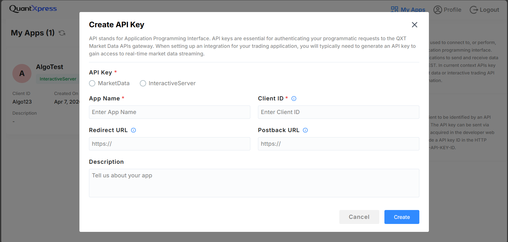
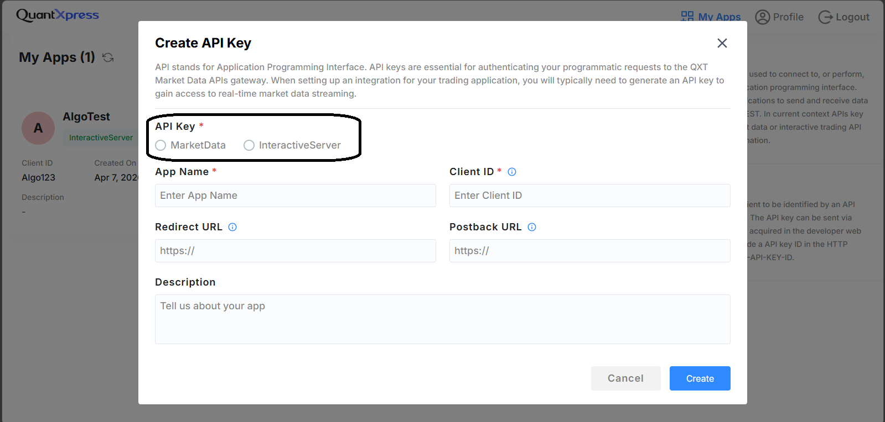

# **BlitzTrader API**

Welcome to **BlitzTrader API** — a unified platform for accessing trading APIs, SDKs, and broker integrations through a scalable, broker-agnostic architecture.

The BlitzTrader API Portal is your gateway to securely integrating your application with the BlitzTrader API ecosystem. It allows you to generate and manage API keys, access API documentation, and test your integration in a secure environment. It's an essential tool for users who want to create apps that interact with BlitzTrader API's powerful trading and market data API.

This quickstart guide will walk you through:

-  [Logging into the portal](#login-page)  
-  [Where to create your account](userSetup/createAccount.md)  
-  [Generating your API key](userSetup/generateKey.md)  
-  [Authenticating your API requests](api/authentication.md)

---

##  Login Page

When you access the BlitzTrader API Portal, you'll see a login screen like this:

### Fields on the Login Screen

- **Email** – Enter the email address you used while registering.
- **Password** – Your login password.

You will also see:

- **Forgot Password?** – Use this if you've forgotten your credentials.
- **Create Account** – New to BlitzTrader API? Click here to register.
---

!!! info "Can't Login?"
    Ensure your email is correct and password is case-sensitive.
    If you're stuck, try the Forgot Password link to reset your password.

---

##  Don’t Have an Account?

If you're a new user, click on **Create Account** at the bottom of the login screen.  
You’ll be guided to the [Account Creation page](userSetup/createAccount.md) where you can sign up with:

- Your full name and contact details  
- A secure password  
- Acceptance of our terms and conditions

!!! info "What Happens Next?"
    After creating your account, you'll be able to log in and generate your API key for using BlitzTrader API programmatically.

---

## BlitzTrader API Dashboard

After logging in, you'll be directed to your **My Apps** dashboard, where you can manage your applications and API keys.

---

### Create first App

If you see "No Apps Available", it means you haven't created any applications yet.

!!! tip "Getting Started"
    To start using the dashboard:

    - Click **Create New App** to register your first application.
    - Once created, you can generate API keys for that app.
    - Manage or delete keys as needed.

---

### Generating Your API Key

To generate an API key, you must create an App:

1. Click **Create** on your dashboard.

    

2. Fill in the **App Creation Form**:
    - **API Key Type**: Select either `MarketData` (for live/historical data) or `InteractiveServer` (for orders and trading).
      
      

    - **App Name**: A descriptive name for your application.
    - **Client ID**: Your unique client identifier.
    - **Redirect URL** & **Postback URL**: Web addresses where your app receives login confirmations and updates.
3. Click **Create API Key**.

Once created, your new API Key will be displayed on the screen. **Copy and store it securely**, as it will not be shown again!

For more detailed information and best practices, check out the full [Generating your API key](userSetup/generateKey.md) guide.