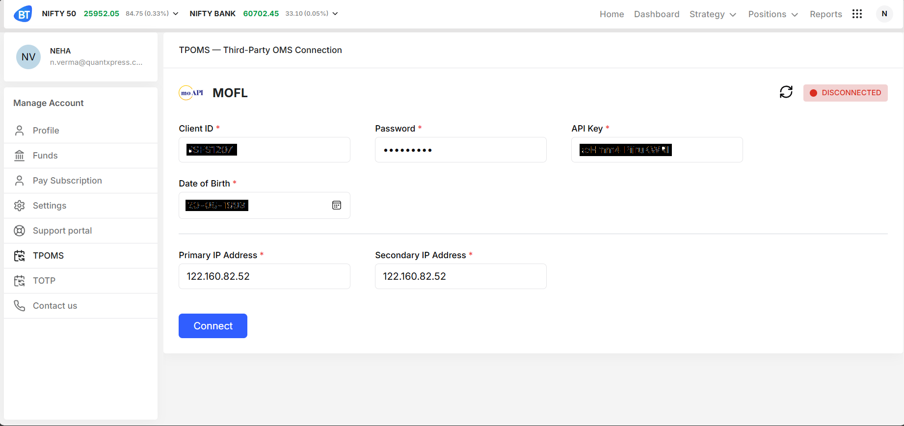

# Motilal Oswal (MOFL) Adapter Documentation

This document explains how to connect **Motilal Oswal (MOFL)** with **Blitz** using the TPOMS MOFL adapter.

---

## Overview

The MOFL adapter allows Blitz to place, modify, cancel orders and receive order updates using Motilal Oswal’s OMS APIs.

---

## Prerequisites

Before you begin, ensure that:

- You have an active **Motilal Oswal trading account**
- API access is enabled for your account
- Your **Client ID**, **Password**, and **API Key** are issued by MOFL
- Your **IP addresses** are whitelisted with Motilal Oswal

---



## TPOMS MOFL Connection

### Connection Details

| Field           | Description              |
| --------------- | ------------------------ |
| OMS Adapter     | `MOFL`                   |
| Connection Type | TPOMS                    |
| Status          | CONNECTED / DISCONNECTED |

---

### Required Credentials

| Field                | Description               | Example         |
| -------------------- | ------------------------- | --------------- |
| Client ID            | Motilal Oswal client code | `xyz`           |
| Password             | Trading account password  | `********`      |
| API Key              | MOFL-issued API key       | `xyz`           |
| Date of Birth        | Account DOB (DD-MM-YYYY)  | `20-09-1993`    |
| Primary IP Address   | Whitelisted IP            | `122.160.82.52` |
| Secondary IP Address | Backup whitelisted IP     | `122.160.82.52` |

### Action

- **Connect** — Establishes a session with MOFL OMS.

---

## Authentication Flow

1. User enters MOFL credentials in TPOMS UI
2. Blitz sends authentication request to MOFL
3. MOFL validates:
   - Client ID
   - Password
   - API Key
   - DOB
   - IP address
4. On success, session is established
5. MOFL adapter status becomes **CONNECTED**

---

# Blitz → MOFL Conversion

Blitz requests are published to the Redis channel and consumed by the **MOFL adapter**.

---

## Place Order

### Blitz Request

```json
{
  "Action": "PLACE_ORDER",
  "TPOmsName": "MOFL",
  "UserId": "82681be6-577f-431e-ac97-5276a8d13405",
  "UserName": "NEHA",
  "Data": {
    "Account": "",
    "ExchangeClientID": "NEHA",
    "ExchangeSegment": "NSECM",
    "ExchangeInstrumentID": 17376,
    "SymbolName": "EXCEL",
    "ExchangeInstrumentName": "EXCEL",
    "ProductType": "CNC",
    "OrderType": "LIMIT",
    "OrderSide": "Buy",
    "TimeInForce": "GFD",
    "DisclosedQuantity": 0,
    "OrderQuantity": 1,
    "LimitPrice": 1.17,
    "StopPrice": 0.0,
    "BlitzAppOrderID": 3156574845,
    "AlgoID": "0",
    "AlgoCategory": "0",
    "IsFictiveOrder": "False"
  }
}
```

The request is then processed with the to_motilal function which convert it to the motilal payload

**Motilal Payload** -> Place Order

```json
{
  "exchange": "NSE",
  "symboltoken": 17376,
  "buyorsell": "BUY",
  "ordertype": "LIMIT",
  "producttype": "DELIVERY",
  "quantityinlot": 1,
  "amoorder": "N",
  "price": 1.17,
  "triggerprice": 0.0,
  "orderduration": "DAY",
  "tag": "3156574845"
}
```

After calling the motilal API with the payload motilal send the response in the below format

**Motilal Websocket Raw Response**

```json
{
  "ordercategory": "DELIVERY",
  "clientid": "SSFS1207",
  "exchange": "NSE",
  "symboltoken": 17376,
  "symbol": "EXCEL EQ",
  "series": "EQ",
  "expirydate": "0",
  "strikeprice": 0,
  "optiontype": "EQ",
  "orderid": "1100000052711400",
  "orderinitiatorid": "SSFS1207",
  "ordertype": "Limit",
  "orderduration": "DAY",
  "producttype": "DELIVERY",
  "error": "",
  "orderstatus": "CONFIRM",
  "buyorsell": "BUY",
  "totalqtyremaining": 1,
  "orderqty": 1,
  "qtytradedtoday": 0,
  "disclosedqty": 0,
  "price": 1.17,
  "triggerprice": 0,
  "entrydatetime": "17-Feb-2026 12:41:06",
  "lastmodifiedtime": "17-Feb-2026 12:41:06",
  "vendor": "",
  "uniqueorderid": "1700005SSFS1207",
  "goodtilldate": "",
  "algoid": 0,
  "algocategory": 0,
  "averageprice": 0,
  "totalqtytraded": 0,
  "lotsize": 1,
  "tag": "3156574845"
}
```

# Motilal to Blitz Conversion

The response is then processed and then converted to blitz format

**Blitz Response**

```json
{
  "SequenceNumber": 0,
  "Account": "SSFS1207",
  "ExchangeClientID": "NEHA",
  "BlitzAppOrderID": 3156574845,
  "ExchangeOrderID": "1100000052711400",
  "ExchangeSegment": "NSECM",
  "ExchangeInstrumentID": 17376,
  "OrderSide": "Buy",
  "OrderType": "LIMIT",
  "ProductType": "CNC",
  "TimeInForce": "GFD",
  "OrderPrice": 1.17,
  "OrderQuantity": 1,
  "OrderStopPrice": 0.0,
  "OrderStatus": "New",
  "OrderAverageTradedPrice": 0.0,
  "LeavesQuantity": 1,
  "CumulativeQuantity": 0,
  "OrderDisclosedQuantity": 0,
  "OrderGeneratedDateTime": "17-Feb-2026 12:41:06",
  "ExchangeTransactTime": "17-Feb-2026 12:41:06",
  "LastUpdateDateTime": "17-Feb-2026 12:41:06",
  "CancelRejectReason": "",
  "LastTradedPrice": 0,
  "LastTradedQuantity": 0,
  "LastExecutionTransactTime": "17-Feb-2026 12:41:06",
  "ExecutionID": ""
}
```

## Modify Order

**Blitz Request**

```json
{
  "Action": "MODIFY_ORDER",
  "TPOmsName": "MOFL",
  "UserId": "82681be6-577f-431e-ac97-5276a8d13405",
  "UserName": "NEHA",
  "Data": {
    "Account": "",
    "ExchangeClientID": "NEHA",
    "ExchangeSegment": "NSECM",
    "ExchangeInstrumentID": 17376,
    "SymbolName": "EXCEL",
    "ExchangeInstrumentName": "EXCEL",
    "ModifiedProductType": "CNC",
    "ModifiedOrderType": "LIMIT",
    "ModifiedTimeInForce": "GFD",
    "ModifiedDisclosedQuantity": 0,
    "ModifiedOrderQuantity": 1,
    "ModifiedLimitPrice": 1.18,
    "ModifiedStopPrice": 0.0,
    "LeavesQuantity": 1,
    "CummulativeQuantity": 0,
    "LastOrderModifiedTime": 1771317855,
    "BlitzAppOrderID": 3156574888,
    "ExchangeOrderID": "1100000070094631"
  }
}
```

**Motilal Payload** -> Modify Order

```json
{
  "uniqueorderid": "1700015SSFS1207",
  "newordertype": "LIMIT",
  "neworderduration": "DAY",
  "newprice": 1.18,
  "newtriggerprice": 0,
  "newquantityinlot": 1,
  "lastmodifiedtime": "17-Feb-2026 14:14:15",
  "qtytradedtoday": 0
}
```

**Motilal Websocket Raw Response (Order status is Open)**

```json
{
  "ordercategory": "DELIVERY",
  "clientid": "SSFS1207",
  "exchange": "NSE",
  "symboltoken": 17376,
  "symbol": "EXCEL EQ",
  "series": "EQ",
  "expirydate": "0",
  "strikeprice": 0,
  "optiontype": "EQ",
  "orderid": "1100000070094631",
  "orderinitiatorid": "SSFS1207",
  "ordertype": "Limit",
  "orderduration": "DAY",
  "producttype": "DELIVERY",
  "error": "",
  "orderstatus": "CONFIRM",
  "buyorsell": "BUY",
  "totalqtyremaining": 1,
  "orderqty": 1,
  "qtytradedtoday": 0,
  "disclosedqty": 0,
  "price": 1.18,
  "triggerprice": 0,
  "entrydatetime": "17-Feb-2026 14:14:15",
  "lastmodifiedtime": "17-Feb-2026 14:14:15",
  "vendor": "",
  "uniqueorderid": "1700015SSFS1207",
  "goodtilldate": "",
  "algoid": 0,
  "algocategory": 0,
  "averageprice": 0,
  "totalqtytraded": 0,
  "lotsize": 1,
  "tag": "3156574888"
}
```

# Motilal to Blitz Conversion

**Blitz Response**

```json
{
  "SequenceNumber": 0,
  "Account": "SSFS1207",
  "ExchangeClientID": "NEHA",
  "BlitzAppOrderID": 3156574888,
  "ExchangeOrderID": "1100000070094631",
  "ExchangeSegment": "NSECM",
  "ExchangeInstrumentID": 17376,
  "OrderSide": "Buy",
  "OrderType": "LIMIT",
  "ProductType": "CNC",
  "TimeInForce": "GFD",
  "OrderPrice": 0.0,
  "OrderQuantity": 1,
  "OrderStopPrice": 0.0,
  "OrderStatus": "Replaced",
  "OrderAverageTradedPrice": 0.0,
  "LeavesQuantity": 1,
  "CumulativeQuantity": 0,
  "OrderDisclosedQuantity": 0,
  "OrderGeneratedDateTime": "17-Feb-2026 14:14:25",
  "ExchangeTransactTime": "17-Feb-2026 14:14:25",
  "LastUpdateDateTime": "17-Feb-2026 14:14:25",
  "CancelRejectReason": "",
  "LastTradedPrice": 0,
  "LastTradedQuantity": 0,
  "LastExecutionTransactTime": "17-Feb-2026 14:14:25",
  "ExecutionID": ""
}
```

## Cancel Order

**Blitz Request**

```json
{
  "Action": "CANCEL_ORDER",
  "TPOmsName": "MOFL",
  "UserId": "82681be6-577f-431e-ac97-5276a8d13405",
  "UserName": "NEHA",
  "Data": {
    "Account": "",
    "ExchangeClientID": "NEHA",
    "ExchangeSegment": "NSECM",
    "ExchangeInstrumentID": 17376,
    "SymbolName": "EXCEL",
    "ExchangeInstrumentName": "EXCEL",
    "LeavesQuantity": 1,
    "CummulativeQuantity": 0,
    "LastOrderModifiedTime": 1771473915,
    "BlitzAppOrderID": 3156574966,
    "ExchangeOrderID": "1100000010027131"
  }
}
```

**Motilal Response**

```json
{
  "ordercategory": "DELIVERY",
  "clientid": "SSFS1207",
  "exchange": "NSE",
  "symboltoken": 17376,
  "symbol": "EXCEL EQ",
  "series": "EQ",
  "expirydate": "0",
  "strikeprice": 0,
  "optiontype": "EQ",
  "orderid": "1100000010027131",
  "orderinitiatorid": "SSFS1207",
  "ordertype": "Limit",
  "orderduration": "DAY",
  "producttype": "DELIVERY",
  "error": "",
  "orderstatus": "CANCEL",
  "buyorsell": "BUY",
  "totalqtyremaining": 1,
  "orderqty": 1,
  "qtytradedtoday": 0,
  "disclosedqty": 0,
  "price": 1.15,
  "triggerprice": 0,
  "entrydatetime": "19-Feb-2026 09:35:23",
  "lastmodifiedtime": "19-Feb-2026 09:35:23",
  "vendor": "",
  "uniqueorderid": "1900001SSFS1207",
  "goodtilldate": "",
  "algoid": 0,
  "algocategory": 0,
  "averageprice": 0,
  "totalqtytraded": 0,
  "lotsize": 1,
  "tag": "3156574966"
}
```

**Blitz Response**

```json
{
  "SequenceNumber": 0,
  "Account": "SSFS1207",
  "ExchangeClientID": "NEHA",
  "BlitzAppOrderID": 3156574966,
  "ExchangeOrderID": "1100000010027131",
  "ExchangeSegment": "NSECM",
  "ExchangeInstrumentID": 17376,
  "OrderSide": "Buy",
  "OrderType": "LIMIT",
  "ProductType": "CNC",
  "TimeInForce": "GFD",
  "OrderPrice": 1.15,
  "OrderQuantity": 1,
  "OrderStopPrice": 0.0,
  "OrderStatus": "Cancelled",
  "OrderAverageTradedPrice": 0.0,
  "LeavesQuantity": 1,
  "CumulativeQuantity": 0,
  "OrderDisclosedQuantity": 0,
  "OrderGeneratedDateTime": "19-Feb-2026 09:35:23",
  "ExchangeTransactTime": "19-Feb-2026 09:35:23",
  "LastUpdateDateTime": "19-Feb-2026 09:35:23",
  "CancelRejectReason": "",
  "LastTradedPrice": 0,
  "LastTradedQuantity": 0,
  "LastExecutionTransactTime": "19-Feb-2026 09:35:23",
  "ExecutionID": ""
}
```
