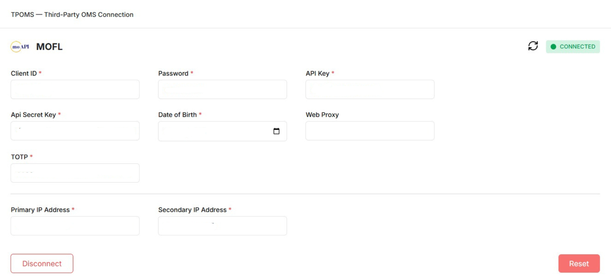

# **Motilal Oswal (MOFL) Adapter Documentation**

This document explains how to connect **Motilal Oswal (MOFL)** with **Blitz** using the TPOMS MOFL adapter.

---

## **Overview**

The MOFL adapter allows Blitz to place, modify, cancel orders and receive order updates using Motilal Oswal’s OMS APIs.

---

## **Prerequisites**

Before you begin, ensure that:

- You have an active **Motilal Oswal trading account**
- API access is enabled for your account
- Your **Client ID**, **Password**, and **API Key** are issued by MOFL
- Your **IP addresses** are whitelisted with Motilal Oswal

---

## **TPOMS MOFL Connection**

### Connection Details

| Field           | Description              |
| --------------- | ------------------------ |
| OMS Adapter     | `MOFL`                   |
| Connection Type | TPOMS                    |
| Status          | CONNECTED / DISCONNECTED |

---

### Required Credentials

| Field                | Description               | Example         |
| -------------------- | ------------------------- | --------------- |
| Client ID            | Motilal Oswal client code | `xyz`           |
| Password             | Trading account password  | `********`      |
| API Key              | MOFL-issued API key       | `xyz`           |
| Date of Birth        | Account DOB (DD-MM-YYYY)  | `20-09-1993`    |
| Primary IP Address   | Whitelisted IP            | `122.160.82.52` |
| Secondary IP Address | Backup whitelisted IP     | `122.160.82.52` |

### Action

- **Connect** — Establishes a session with MOFL OMS.

---

## **Authentication Flow**

1. User enters MOFL credentials in TPOMS UI
2. Blitz sends authentication request to MOFL
3. MOFL validates:
   - Client ID
   - Password
   - API Key
   - DOB
   - IP address
4. On success, session is established
5. MOFL adapter status becomes **CONNECTED**

---

