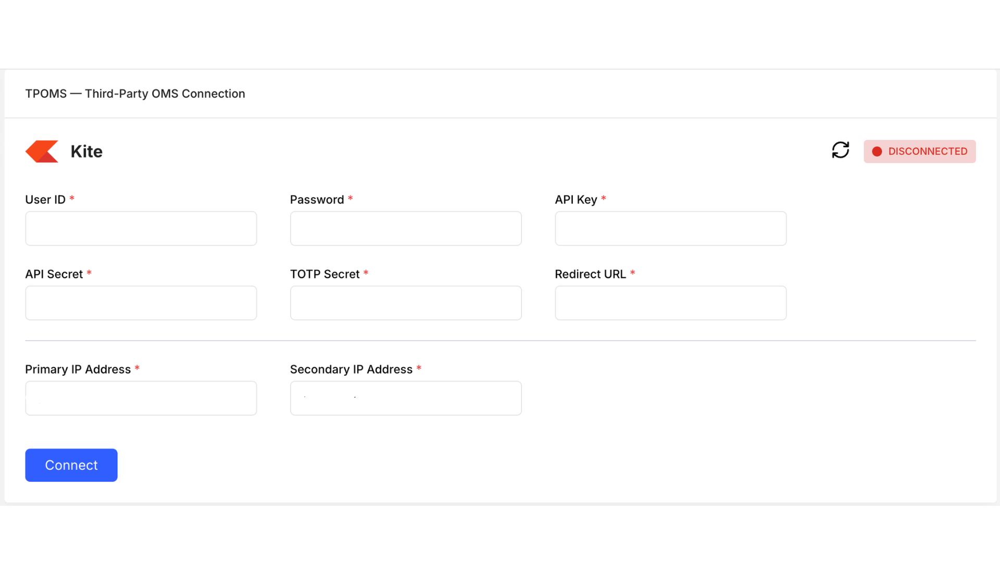

# Zerodha Adapter Documentation

This document explains how to connect **Zerodha** with **Blitz** using Zerodha’s Kite Connect APIs.

---

## Prerequisites

Before you begin, ensure that:

- You have an active Zerodha trading account
- Kite Connect API access is enabled for your account

---

## Create a Zerodha Developer Account

1. Visit the Zerodha developer portal: [Zerodha Developer Portal](https://developers.kite.trade/signup)


2. Sign up or log in to create the account.

3. You will redirected to the App creation page of zerodha.
   

4. Click on the Create new App button and choose Personal and fill the mandatory detials
   

---

## Get API Credentials

After creating the app, Zerodha will provide:

- **API Key**
- **API Secret**
  

> ⚠️ Keep these credentials secure. Do not expose them in public.

---

## Generate TOTP Secret

Login to the zerodha dashboard using the link [Zerodha Login](https://kite.zerodha.com/)

- Go to Password & Security at the top right corner of of your dashboard
  

- Enable 2FA TOTP
  

- Download google authenticator app on your mobile and before scanning the QR code click on "Can't Scan? Copy the Code" at the bottom of the QR Code, and save the text this is your TOTP Secret
  

---

## Fill all the credentials in the TPOMS

After successfully generating all the credentials like

- API Key
- API Secret
- TOTP Secret

Login in to TPOMS


Click the Connect button and you are connected

---

## Blitz to Zerodha Conversion

Blitz request is published to the redis channel

## Place Order

**Blitz Request**

```json
{
  "Action": "PLACE_ORDER",
  "TPOmsName": "Zerodha",
  "UserId": "ABC123",
  "UserName": "XYZ",
  "Data": {
    "Account": "Test123",
    "ExchangeClientID": "CLIENT_01",
    "ExchangeSegment": "NSECM",
    "ExchangeInstrumentID": 1234,
    "SymbolName": "IDEA",
    "ExchangeInstrumentName": "VODAFONE IDEA LIMITED",
    "ProductType": "MIS",
    "OrderType": "LIMIT",
    "OrderSide": "BUY",
    "TimeInForce": "DAY",
    "DisclosedQuantity": "10",
    "OrderQuantity": "100",
    "LimitPrice": 11.25,
    "StopPrice": 11.0,
    "BlitzAppOrderID": 4576347291,
    "AlgoID": "MOMENTUM_V1",
    "AlgoCategory": "INTRADAY",
    "IsFictiveorder": "False"
  }
}
```

| Parameter Name         | Description                                                   |
| ---------------------- | ------------------------------------------------------------- |
| Account                | Trading account identifier                                    |
| ExchangeClientID       | Client ID                                                     |
| ExchangeSegment        | Exchange segment `NSECM`, `NSEFO`                             |
| ExchangeInstrumentID   | Unique instrument ID at exchange                              |
| SymbolName             | Trading symbol                                                |
| ExchangeInstrumentName | Full instrument                                               |
| ProductType            | Order product type `ALL`, `NONE`, `CNC`, `NRML`, `MIS`, `MFT` |
| OrderType              | Type of order `MARKET`, `LIMIT`, `STOPLIMIT`, `SL-M`          |
| OrderSide              | Buy or Sell direction `BUY`, `SELL`                           |
| TimeInForce            | Order validity `DAY`, `IOC`                                   |
| DisclosedQuantity      | Quantity to be disclosed to the market                        |
| OrderQuantity          | Total order quantity                                          |
| LimitPrice             | Limit price (required for LIMIT orders)                       |
| StopPrice              | Trigger price for stop-loss orders                            |
| BlitzAppOrderID        | Unique order ID generated by Blitz                            |
| AlgoID                 | Algorithm identifier                                          |
| AlgoCategory           | Category of algorithm used                                    |
| IsFictiveorder         | `TRUE`, `FALSE`                                               |

The request is then processed with the `to_zerodha` function which convert it to the zerodha payload

**Zerodha Payload** -> Place Order

```json
{
  "tradingsymbol": "IDEA",
  "exchange": "NSE",
  "transaction_type": "BUY",
  "order_type": "LIMIT",
  "quantity": 100,
  "product": "MIS",
  "price": 11.25,
  "trigger_price": 11.0,
  "disclosed_quantity": 10,
  "validity": "DAY"
}
```

**Blitz <-> Zerodha Mapping**

| Blitz Field.      | Zerodha Field      |
| ----------------- | ------------------ |
| ExchangeSegment   | exchange           |
| SymbolName        | tradingsymbol      |
| OrderSide         | transaction_type   |
| OrderType         | order_type         |
| OrderQuantity     | quantity           |
| ProductType       | product            |
| LimitPrice        | price              |
| StopPrice         | trigger_price      |
| DisclosedQuantity | disclosed_quantity |
| TimeInForce       | validity           |

After calling the zerodha API with the payload zerodha send the response in the below format

**Zerodha Websocket Raw Response (Order status is Open)**

```json
{
  "account_id": "RGZ539",
  "unfilled_quantity": 0,
  "checksum": "",
  "placed_by": "RGZ539",
  "order_id": "260108152046774",
  "exchange_order_id": "1100000084582744",
  "parent_order_id": null,
  "status": "OPEN",
  "status_message": null,
  "status_message_raw": null,
  "order_timestamp": "2026-01-08 15:23:46",
  "exchange_update_timestamp": "2026-01-08 15:23:46",
  "exchange_timestamp": "2026-01-08 15:23:46",
  "variety": "regular",
  "exchange": "NSE",
  "tradingsymbol": "IDEA",
  "instrument_token": 3677697,
  "order_type": "LIMIT",
  "transaction_type": "BUY",
  "validity": "DAY",
  "product": "MIS",
  "quantity": 100,
  "disclosed_quantity": 10,
  "price": 11.25,
  "trigger_price": 11.0,
  "average_price": 0,
  "filled_quantity": 0,
  "pending_quantity": 1,
  "cancelled_quantity": 0,
  "market_protection": 0,
  "meta": {},
  "tag": null,
  "guid": "1767866026-514556-RGZ539-ADMINAPI"
}
```

Zerodha to Blitz Conversion

The response is then processed and then converted to blitz format

**Blitz Response**

```json
{
  "SequenceNumber": 0,
  "Account": "Test123",
  "ExchangeClientID": "CLIENT_01",
  "BlitzAppOrderID": 4576347291,
  "ExchangeOrderID": "1100000084582744",
  "ExchangeSegment": "NSE",
  "ExchangeInstrumentID": 3677697,
  "OrderSide": "BUY",
  "OrderType": "LIMIT",
  "ProductType": "MIS",
  "TimeInForce": "DAY",
  "OrderPrice": 11.25,
  "OrderQuantity": 100,
  "OrderStopPrice": 11.0,
  "OrderStatus": "NEW",
  "OrderAverageTradedPrice": "0",
  "LeavesQuantity": 100,
  "CumulativeQuantity": 0,
  "OrderDisclosedQuantity": 10,
  "OrderGeneratedDateTime": "2026-01-08 15:23:46",
  "ExchangeTransactTime": "2026-01-08 15:23:46",
  "LastUpdateDateTime": "2026-01-08 15:23:46",
  "CancelRejectReason": null,
  "LastTradedPrice": 0,
  "LastTradedQuantity": 0,
  "LastExecutionTransactTime": null,
  "ExecutionID": ""
}
```

**Mapping of zerdha to blitz**

| Zerodha Field             | Blitz Field             |
| ------------------------- | ----------------------- |
| exchange_order_id         | ExchangeOrderID         |
| exchange                  | ExchangeSegment         |
| instrument_token          | ExchangeInstrumentID    |
| transaction_type          | OrderSide               |
| order_type                | OrderType               |
| product                   | ProductType             |
| validity                  | TimeInForce             |
| price                     | OrderPrice              |
| quantity                  | OrderQuantity           |
| trigger_price             | OrderStopPrice          |
| status                    | OrderStatus             |
| average_price             | OrderAverageTradedPrice |
| pending_quantity          | LeavesQuantity          |
| filled_quantity           | CumulativeQuantity      |
| disclosed_quantity        | OrderDisclosedQuantity  |
| order_timestamp           | OrderGeneratedDateTime  |
| exchange_timestamp        | ExchangeTransactTime    |
| exchange_update_timestamp | LastUpdateDateTime      |

## Modify Order

**Blitz Request**

```json
{
  "Action": "MODIFY_ORDER",
  "TPOmsName": "Zerodha",
  "UserId": "ABC123",
  "UserName": "XYZ",
  "Data": {
    "Account": "Test123",
    "ExchangeClientID": "CLIENT_01",
    "ExchangeSegment": "NSECM",
    "ExchangeInstrumentID": 1234,
    "SymbolName": "IDEA",
    "ExcahngeInstrumnetName": "VODAFONE IDEA LIMITED",
    "ModifiedProductType": "NRML",
    "ModifiedOrderType": "LIMIT",
    "ModifiedTimeInForce": "IOC",
    "ModifiedDisclosedQuantity": 10,
    "ModifiedOrderQuantity": 150,
    "ModifiedLimitPrice": 11.15,
    "ModifiedStopPrice": 11.1,
    "LeavesQuantity": 50,
    "CumulativeQuantity": 100,
    "LastOrderModifiedTime": "2026-01-08 15:23:46",
    "BlitzAppOrderID": 1234567891,
    "ExchangeOrderID": "EXCH_ORD_987654"
  }
}
```

**Zerodha Response**

```json
{
  "account_id": "RGZ539",
  "unfilled_quantity": 0,
  "checksum": "",
  "placed_by": "RGZ539",
  "order_id": "260108152046774",
  "exchange_order_id": "1100000084582744",
  "parent_order_id": null,
  "status": "UPDATE",
  "status_message": null,
  "status_message_raw": null,
  "order_timestamp": "2026-01-08 15:23:46",
  "exchange_update_timestamp": "2026-01-08 15:23:46",
  "exchange_timestamp": "2026-01-08 15:23:46",
  "variety": "regular",
  "exchange": "NSE",
  "tradingsymbol": "IDEA",
  "instrument_token": 3677697,
  "order_type": "LIMIT",
  "transaction_type": "BUY",
  "validity": "DAY",
  "product": "MIS",
  "quantity": 100,
  "disclosed_quantity": 10,
  "price": 11.25,
  "trigger_price": 0,
  "average_price": 0,
  "filled_quantity": 0,
  "pending_quantity": 100,
  "cancelled_quantity": 0,
  "market_protection": 0,
  "meta": {},
  "tag": null,
  "guid": "205871XvWfpJkFLquRq"
}
```

**Blitz Response**

```json
{
  "SequenceNumber": 0,
  "Account": "Test123",
  "ExchangeClientID": "CLIENT_01",
  "BlitzAppOrderID": 1234567891,
  "ExchangeOrderID": "1100000084582744",
  "ExchangeSegment": "NSE",
  "ExchangeInstrumentID": 3677697,
  "OrderSide": "BUY",
  "OrderType": "LIMIT",
  "ProductType": "MIS",
  "TimeInForce": "DAY",
  "OrderPrice": 11.25,
  "OrderQuantity": 100,
  "OrderStopPrice": 0,
  "OrderStatus": "REPLACED",
  "OrderAverageTradedPrice": "0",
  "LeavesQuantity": 100,
  "CumulativeQuantity": 0,
  "OrderDisclosedQuantity": 0,
  "OrderGeneratedDateTime": "2026-01-08 15:23:46",
  "ExchangeTransactTime": "2026-01-08 15:23:46",
  "LastUpdateDateTime": "2026-01-08 15:23:46",
  "CancelRejectReason": null,
  "LastTradedPrice": 0,
  "LastTradedQuantity": 0,
  "LastExecutionTransactTime": null,
  "ExecutionID": "260108152046774"
}
```

## Cancel Order

**Blitz Request**

```json
{
  "action": "CANCEL_ORDER",
  "tpOmsName": "Zerodha",
  "user_id": "ABC123",
  "Data": {
    "Account": "TRADING456",
    "ExchangeClientID": "CLIENT_789",
    "ExchangeSegment": "NSECM",
    "ExchangeInstrumentID": 3677697,
    "SymbolName": "NIFTY",
    "ExchangeInstrumentName": "IDEA",
    "LeavesQuantity": 150,
    "CummulativeQuantity": 50,
    "LastOrderModifiedTime": "2026-01-20 15:23:46",
    "BlitzAppOrderID": 4058284572,
    "ExchangeOrderID": "NSE_ORD_1234567",
    "UserLoginName": "XYZ"
  }
}
```

**Zerodha Response**

```json
{
  "account_id": "RGZ539",
  "unfilled_quantity": 0,
  "checksum": "",
  "placed_by": "RGZ539",
  "order_id": "260108152046774",
  "exchange_order_id": "1100000084582744",
  "parent_order_id": null,
  "status": "CANCELLED",
  "status_message": null,
  "status_message_raw": null,
  "order_timestamp": "2026-01-08 15:23:57",
  "exchange_update_timestamp": "2026-01-08 15:23:57",
  "exchange_timestamp": "2026-01-08 15:23:57",
  "variety": "regular",
  "exchange": "NSE",
  "tradingsymbol": "IDEA",
  "instrument_token": 3677697,
  "order_type": "LIMIT",
  "transaction_type": "BUY",
  "validity": "DAY",
  "product": "MIS",
  "quantity": 150,
  "disclosed_quantity": 0,
  "price": 11.35,
  "trigger_price": 0,
  "average_price": 0,
  "filled_quantity": 0,
  "pending_quantity": 0,
  "cancelled_quantity": 150,
  "market_protection": 0,
  "meta": {},
  "tag": null,
  "guid": "1767866037-597794-RGZ539-ADMINAPI"
}
```

**Blitz Response**

```json
{
  "MessageType": "CANCEL_ORDER",
  "tpOmsName": "Zerodha",
  "user_id": "ABC123",
  "Data": {
    "SequenceNumber": 0,
    "Account": "TRADING456",
    "ExchangeClientID": "CLIENT_789",
    "BlitzAppOrderID": 4058284572,
    "ExchangeOrderID": "1100000084582744",
    "ExchangeSegment": "NSE",
    "ExchangeInstrumentID": 3677697,
    "OrderSide": "BUY",
    "OrderType": "LIMIT",
    "ProductType": "MIS",
    "TimeInForce": "DAY",
    "OrderPrice": 11.35,
    "OrderQuantity": 150,
    "OrderStopPrice": 0,
    "OrderStatus": "CANCELLED",
    "OrderAverageTradedPrice": "0",
    "LeavesQuantity": 0,
    "CumulativeQuantity": 0,
    "OrderDisclosedQuantity": 0,
    "OrderGeneratedDateTime": "2026-01-08 15:23:57",
    "ExchangeTransactTime": "2026-01-08 15:23:57",
    "LastUpdateDateTime": "2026-01-08 15:23:57",
    "CancelRejectReason": null,
    "LastTradedPrice": 0,
    "LastTradedQuantity": 0,
    "LastExecutionTransactTime": null,
    "ExecutionID": ""
  }
}
```

# Rejected Order Scenarios

This section describes failure responses returned when broker rejects an operation.

## Place Order Rejected

Occurs when broker rejects order placement due to validation failure, insufficient margin, invalid price, etc.

### Blitz Response

```json
{
  "SequenceNumber": 0,
  "Account": "Test123",
  "ExchangeClientID": "CLIENT_01",
  "BlitzAppOrderID": 4576347291,
  "ExchangeOrderID": "",
  "ExchangeSegment": "NSE",
  "ExchangeInstrumentID": 3677697,
  "OrderSide": "BUY",
  "OrderType": "LIMIT",
  "ProductType": "MIS",
  "TimeInForce": "DAY",
  "OrderPrice": 11.25,
  "OrderQuantity": 100,
  "OrderStopPrice": 0,
  "OrderStatus": "REJECTED",
  "OrderAverageTradedPrice": 0,
  "LeavesQuantity": 0,
  "CumulativeQuantity": 0,
  "OrderDisclosedQuantity": 0,
  "OrderGeneratedDateTime": "2026-01-08 15:23:46",
  "ExchangeTransactTime": null,
  "LastUpdateDateTime": "2026-01-08 15:23:46",
  "CancelRejectReason": "Insufficient margin",
  "LastTradedPrice": 0,
  "LastTradedQuantity": 0,
  "LastExecutionTransactTime": null,
  "ExecutionID": ""
}
```

---

## Modify Order Rejected (Replace Rejected)

Occurs when broker rejects an order modification request.

### Blitz Response

```json
{
  "SequenceNumber": 0,
  "Account": "Test123",
  "ExchangeClientID": "CLIENT_01",
  "BlitzAppOrderID": 1234567891,
  "ExchangeOrderID": "1100000084582744",
  "ExchangeSegment": "NSE",
  "ExchangeInstrumentID": 3677697,
  "OrderSide": "BUY",
  "OrderType": "LIMIT",
  "ProductType": "MIS",
  "TimeInForce": "DAY",
  "OrderPrice": 11.25,
  "OrderQuantity": 100,
  "OrderStopPrice": 0,
  "OrderStatus": "Replace Rejected",
  "OrderAverageTradedPrice": 0,
  "LeavesQuantity": 100,
  "CumulativeQuantity": 0,
  "OrderDisclosedQuantity": 0,
  "OrderGeneratedDateTime": "2026-01-08 15:23:46",
  "ExchangeTransactTime": "2026-01-08 15:23:46",
  "LastUpdateDateTime": "2026-01-08 15:24:10",
  "CancelRejectReason": "Modification not allowed for completed order",
  "LastTradedPrice": 0,
  "LastTradedQuantity": 0,
  "LastExecutionTransactTime": null,
  "ExecutionID": ""
}
```
