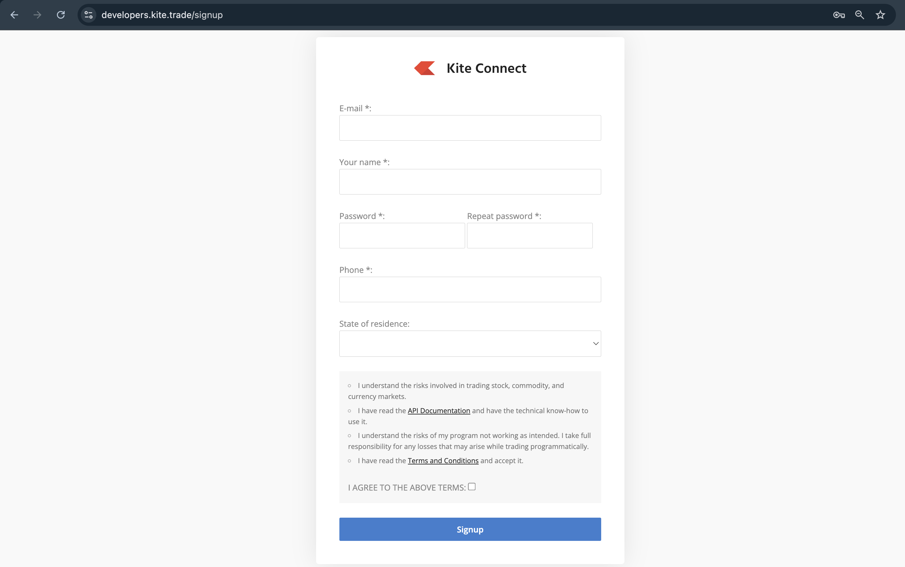
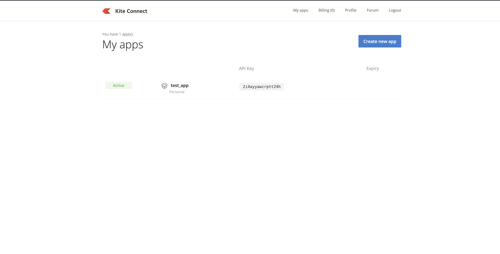
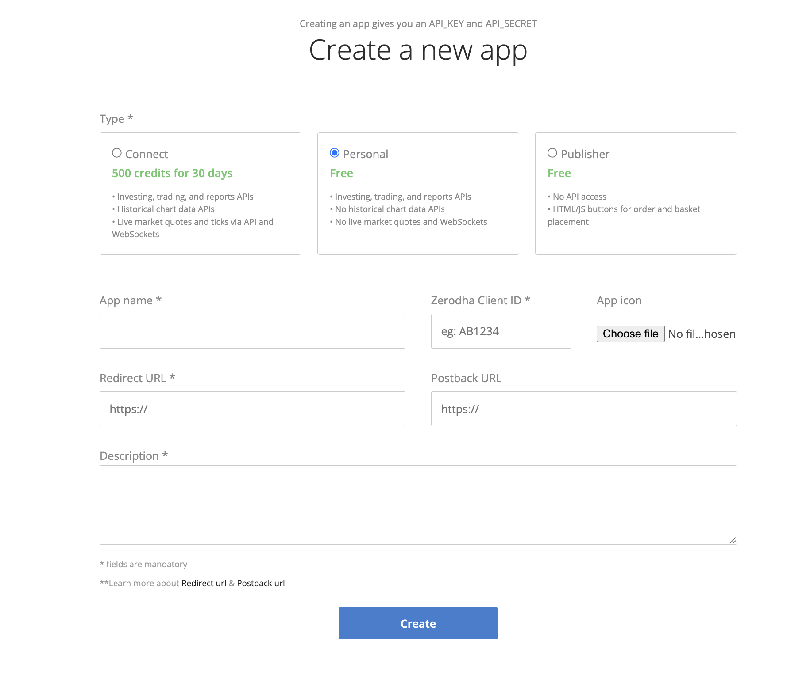
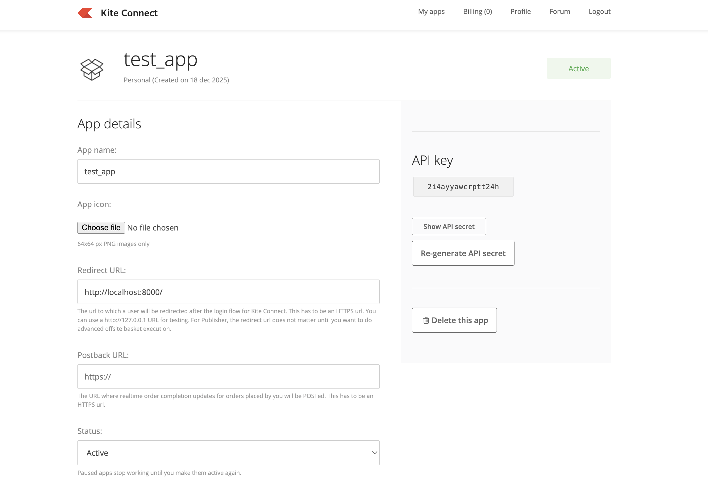
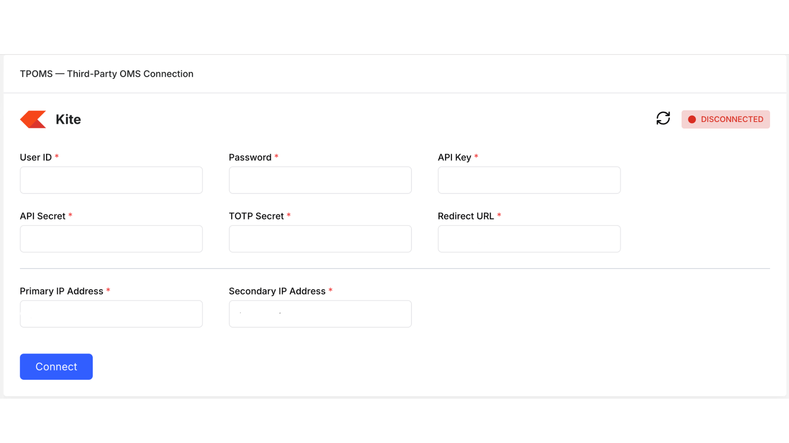

# **Zerodha Adapter Documentation**

This document explains how to connect **Zerodha** with **Blitz** using Zerodha’s Kite Connect APIs.

---

## **Prerequisites**

Before you begin, ensure that:

- You have an active Zerodha trading account
- Kite Connect API access is enabled for your account

---

## **Create a Zerodha Developer Account**

1. Visit the Zerodha developer portal: [Zerodha Developer Portal](https://developers.kite.trade/signup)

2. Sign up or log in to create the account.

3. You will be redirected to the App creation page of Zerodha.
   

4. Click on the Create new App button and choose Personal and fill the mandatory details
   

---

## **Get API Credentials**

After creating the app, Zerodha will provide:

- **API Key**
- **API Secret**
  

> ⚠️ Keep these credentials secure. Do not expose them in public.

---

## **Generate TOTP Secret**

Login to the zerodha dashboard using the link [Zerodha Login](https://kite.zerodha.com/)

- Go to Password & Security at the top right corner of your dashboard
  

- Enable 2FA TOTP
  

- Download google authenticator app on your mobile and before scanning the QR code click on "Can't Scan? Copy the Code" at the bottom of the QR Code, and save the text this is your TOTP Secret
  

---

## **Fill all the credentials in the TPOMS**

After successfully generating all the credentials like

- API Key
- API Secret
- TOTP Secret

Login in to TPOMS

Click the Connect button and you are connected

---

