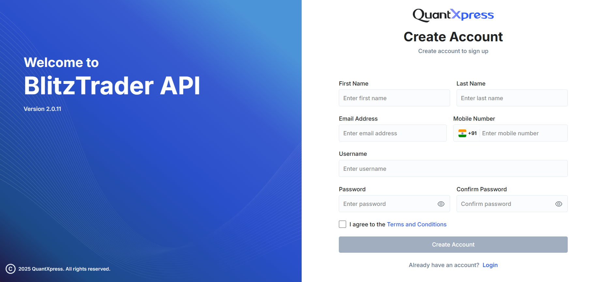

# Create Your Account

To start using the **BlitzTrader API**, you first need to register and create an account. This quick guide will walk you through the sign-up process on the BlitzTrader portal.

---

## Steps to Sign Up

### 1. Open the Create Account Page
Go to the BlitzTrader login screen and click on the **Create Account** link at the bottom.

### 2. Fill in the Form Details
You will need to provide some basic information to set up your account:

- **First & Last Name**: Your full legal name.
- **Email Address**: An active email address. *(We will send important account notifications and verification links here).*
- **Mobile Number**: A valid mobile number. *(Make sure you can receive SMS on this number for OTP verifications and alerts).*
- **Username**: A unique name you will use to log into your account.
- **Password**: A strong, secure password to protect your account.

!!! tip "Password Guidelines"
    To keep your account safe, your password must:
    - Be at least **8 characters** long.
    - Include both **uppercase and lowercase** letters.
    - Include at least **one number** and **one special character** (e.g., `@`, `#`, `!`).

### 3. Accept Terms & Conditions
Before you can proceed, you must check the box that says **"I agree to the Terms and Conditions"**.

!!! info
    Make sure to read through the terms before accepting. This includes our general platform terms as well as POS machine terms, which govern the use of BlitzTrader services.

### 4. Complete Registration
Once all fields are filled out correctly, click the **Create Account** button to finish registering.

That's it! If you already have an account, you can simply click the **Login** link instead to sign in directly.
