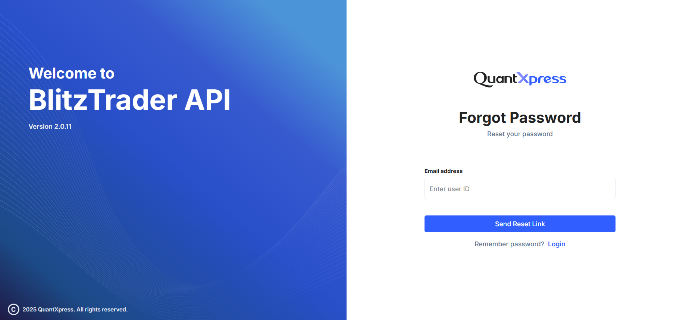
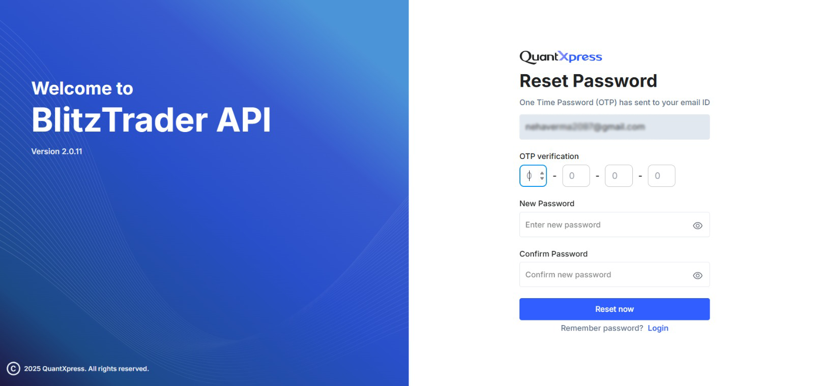

# Reset Password

If you've forgotten your password, the **BlitzTrader** portal offers a simple and secure process to get you back into your account.

---

## Step-by-Step Guide

### 1. Request a Password Reset
Start by clicking the **"Forgot Password?"** link on the main login screen. 

- Enter the **Email Address / User ID** associated with your BlitzTrader account.
- Click the **Send Reset Link** button.

Once submitted, the system will send a secure **4-digit OTP (One-Time Password)** to your registered email address.

---

### 2. Enter OTP and New Password
After requesting the reset, you will be automatically redirected to the **Reset Password** screen.

You will need to fill in the following details:

- **OTP**: Enter the 4-digit code sent to your email.
- **New Password**: Type in your new secure password.
- **Confirm Password**: Re-type the password to make sure there are no typos.

!!! tip "Password Guidelines"
    To keep your account secure, your password should:
    - Be at least **8 characters** long.
    - Include both **uppercase and lowercase** letters.
    - Include at least **one number** and **one symbol**.
    - Avoid using personal info or previously used passwords.

Once everything is filled out, click **Reset Now**.

---

### 3. Log Back In
If your OTP is correct and your passwords match, you will see a success confirmation!

Your password has been successfully updated. Click the **Login** button to return to the main login screen and sign in with your new credentials.

---

!!! note "Things to keep in mind"
    - **Check your spam folder:** If you don't see the OTP in your inbox, it might have been filtered.
    - **OTPs expire quickly:** If your OTP expires before you use it, you will need to restart the process.
    - **Security alert:** If you receive an OTP but didn't request a password reset, please contact QuantXpress Support immediately.
